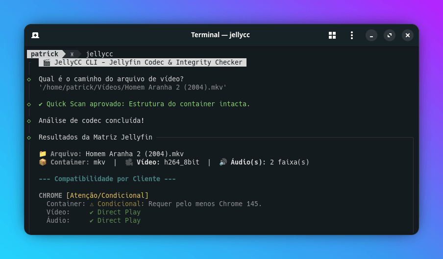

<div align="center">
  <h1 align="center">JellyCC CLI</h1>
  
</div>

Uma CLI inteligente que diagnostica, audita e otimiza sua mídia para garantir _Direct Play_ no seu Jellyfin.

[](https://bun.sh/) [](https://ffmpeg.org/)

## ✨ Funcionalidades

- **Motor de Qualidade Dinâmica:** Transcoding visualmente sem perdas (CRF 18) e áudio otimizado matematicamente por canal, sem inflar o tamanho do arquivo original.
- **Remuxing Inteligente (`merge`):** Mescle a imagem de um release de alta qualidade com dublagens e legendas de outros arquivos. O "Juiz Visual" elege a melhor base de vídeo automaticamente.
- **Progress UI & Tail Log:** Conversões e varreduras exibem barras de progresso dinâmicas e logs limpos em tempo real, sem poluir o terminal.
- **Inteligência de Legendas:** Detecta legendas baseadas em imagens (PGS/VobSub) e alerta sobre o risco de _Burn-in_ (gargalo de CPU no servidor).
- **Auto-Limpeza de Container:** Remove fotos anexadas (capas `mjpeg`/`png`) para prevenir corrupção e erros de FPS.
- **Verificação de Integridade:** `Quick Scan` para validar cabeçalhos e `Deep Scan` (quadro a quadro) para caçar artefatos e falhas no bitstream.

## 🛠️ Pré-requisitos

- **[Bun](https://bun.sh/)** (Runtime JavaScript)
- **FFmpeg & FFprobe** (Instalados globalmente no sistema)

## 📦 Instalação

> [!IMPORTANT]
> Certifique-se de que o **FFmpeg** e o **FFprobe** estejam instalados no seu sistema de forma global, pois o JellyCC depende estritamente deles para realizar as análises e conversões.

1. Clone o repositório.
2. Dê permissão de execução ao script:
   ```bash
   chmod +x ./install.sh
   ```
3. Execute o script de instalação:
   ```bash
   ./install.sh
   ```

## 🚀 Como Usar

> [!TIP]
> Arraste e solte o arquivo de vídeo direto no terminal para preencher o caminho automaticamente.

### 🔍 Analisar e Otimizar (`check`)

Cruza a mídia com a matriz de suporte e sugere (ou executa) o comando de conversão.

```bash
jellycc /caminho/do/filme.mkv
```

### ☄️ Auditoria Forçada (`--deep-scan`)

Varredura profunda para garantir que o arquivo não está corrompido.

```bash
jellycc --deep-scan /caminho/do/filme.mkv
```

### 🧬 Mesclar Arquivos (`merge`)

Abre um painel interativo para selecionar trilhas de áudio, vídeo e legenda de múltiplas fontes.

```bash
jellycc merge
```

## ⚙️ Configuração (Fallback Rules)

A "fonte da verdade" do JellyCC mora no arquivo `fallback_rules.yaml`. É nele que você define os alvos ideais do seu servidor. Por padrão, ele está otimizado para a máxima compatibilidade (`MKV`, `H264`, `EAC3`/`AAC`). O motor interno ajustará os parâmetros técnicos automaticamente baseado nessas regras.
