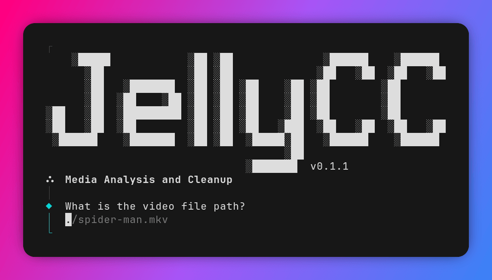

<div align="center">
  <h1 align="center">JellyCC CLI</h1>
</div>
<p align="center">
  Uma CLI inteligente que diagnostica, audita, repara, padroniza e otimiza sua mídia para garantir <i>Direct Play</i> no Jellyfin.
</p>

<p align="center">
  <a href="https://bun.sh/"></a> 
  <a href="https://bomb.sh/"></a> 
  <a href="https://ffmpeg.org/"></a>
  <a href="https://codecov.io/github/parkejunior/jellycc-cli"></a>
</p>

<p align="center">
  <a href="README.md">🇬🇧 English</a> |
  <a href="README.pt.md">🇧🇷 Português (Brasil)</a>
</p>

<div align="center">
  
</div>

## ✨ Funcionalidades

- 🔍 **Análise de Compatibilidade** — Matriz de compatibilidade com Direct Play por cliente Jellyfin (Chrome, Firefox, Android TV, etc.).
- 🚀 **Limpeza (Remux)** — Reencapsula para MKV sem recodificar, preservando qualidade original.
- 🔄 **Conversão (Transcode)** — Converte para codecs Direct Play (H.264 8-bit / AAC, EAC3 ou FLAC) com regras de fallback configuráveis.
- 🔧 **Reparo Forçado** — Corrige arquivos com timestamps corrompidos via pipeline intermediário (`.w64`/`.mp4`).
- 🔬 **Quick Scan + Deep Scan** — Verifica integridade do container e analisa quadro a quadro em busca de artefatos e erros.
- 🔬 **Myopic Scan** — Deep Scan restrito apenas às faixas selecionadas.
- 🔊 **Silence Scan** — Analisar e identificar longos períodos de silêncio nas faixas de áudio.
- 🎛️ **Seleção de Faixas** — Escolha quais streams de vídeo, áudio e legenda manter no arquivo final.
- 🎶 **Smart Spectrum Sync** — Alinha automaticamente faixas de áudio de origens diferentes, usando correlação matemática de ondas sonoras.
- ⏱️ **Ajuste de Sincronia / Corte Final** — Define offset temporal e corte final para evitar problemas de lip-sync.
- 🔀 **Mesclagem de Arquivos** — Une faixas de dois arquivos em um único MKV, com sync automático/manual e Modo Estrito.
- 🏷️ **Edição de Tags** — Edita idioma (ex: `por`, `eng`, `jpn`) e título de cada faixa.
- 🌐 **Internacionalização** — Interface em Inglês (en-US) e Português do Brasil (pt-BR).
- ⚠️ **Detecção de Lixo Embutido** — Detecta e remove capas/thumbnails e legendas PGS que forçam transcoding.

## 🛠️ Pré-requisitos

- **[FFmpeg & FFprobe](https://www.ffmpeg.org/download.html)** (Instalados globalmente no sistema)

## 📦 Instalação

> [!IMPORTANT]
> O script de instalação atualmente baixa binários nativos para **Linux** (x86_64 / ARM64). O suporte nativo a macOS estará disponível em breve! Para **Windows**, utilize o **Docker** abaixo.

Execute o script de instalação:
```bash
curl -fsSL https://raw.githubusercontent.com/parkejunior/jellycc-cli/main/install.sh | bash
```

## 🐳 Docker

Execute o JellyCC em um container em qualquer sistema operacional (**Linux**, **macOS** ou **Windows / WSL2**) sem precisar instalar o FFmpeg no seu sistema.

### Uso Rápido (Imagem Oficial)

Execute diretamente apontando para a sua pasta de mídias:

```bash
docker run --rm -it -v /caminho/para/midias:/media ghcr.io/parkejunior/jellycc-cli:latest
```

### Usando Docker Compose

```bash
# Executar na pasta atual
docker compose run --rm jellycc

# Executar em uma pasta de mídias específica
MEDIA_DIR=/caminho/para/midias docker compose run --rm jellycc

# Executar um comando específico
MEDIA_DIR=/caminho/para/midias docker compose run --rm jellycc check "video.mkv"
```

> [!NOTE]
> `MEDIA_DIR` é montado em `/media` dentro do container (padrão `.`). Os arquivos gerados são salvos na mesma pasta montada. Ao usar o Docker Compose, as [configurações](docs/CONFIGURATION.pt.md#configuração-no-docker) em `~/.config/jellycc` são salvas de forma persistente.

## 🚀 Uso

### Analise e limpeza

Para analisar um arquivo de vídeo, execute o comando:
```bash
jellycc
```
Ou se preferir, você pode abrir o arquivo diretamente no terminal:

```bash
jellycc check [caminho/do/arquivo]
# ou
jellycc [caminho/do/arquivo]
```

Se você quiser executar a análise completa, inclua o parâmetro `--deep-scan`:
```bash
jellycc check [caminho/do/arquivo] --deep-scan
```

### Mesclagem

Para mesclar vários arquivos em um único MKV, execute o comando:
```bash
jellycc merge
```

> [!NOTE]
> Por padrão, o JellyCC mescla os arquivos usando o **Optimized Full Repair** (extraindo e alinhando as streams individualmente para evitar problemas de sincronização e silêncio no final).
> Você pode escolher o modo **Legacy** no menu para fazer um remux direto sem arquivos temporários, caso as streams de origem tenham estruturas e timestamps totalmente íntegros.

### Configuração

Caso queira alterar o idioma da interface ou criar um arquivo de configuração `rules.json`, execute o comando:
```bash
jellycc config
```

> [!TIP]
> Arraste e solte o arquivo de vídeo direto no terminal para preencher o caminho automaticamente.

> [!NOTE]
> O resultado é salvo na mesma pasta da mídia original com os sufixos `.jellycc.mkv` ou `.jellycc_merged.mkv`.

## ☰ Menu Interativo

Após a análise de um arquivo, um menu interativo é exibido com as seguintes opções:

- 🚀 **Limpeza (Remux)** — Reencapsula sem recodificar.
- 🔄 **Conversão** — Converte codecs incompatíveis para *Direct Play*
- 🔧 **Reparo Forçado** — Recodificação via pipeline intermediário para arquivos com timestamps corrompidos.
- 🎛️ **Modificar faixas** — Seleciona quais streams de vídeo, áudio e legenda manter.
- ⏱️ **Ajustar Sincronia / Corte Final** — Define offset temporal e corte final.
- 🔍 **Deep Scan** — Análise quadro a quadro de todas as faixas.
- 🔬 **Myopic Scan** — Deep Scan apenas nas faixas selecionadas.
- 🔊 **Silence Scan** — Detecta longos períodos de silêncio nas faixas de áudio.
- 🏷️ **Editar Tags** — Edita o idioma e título de cada faixa.

## ⚙️ Configuração

Você pode ver a lista completa de configurações na [documentação de configuração](docs/CONFIGURATION.pt.md).

## ⚖️ Licença

JellyCC é licenciado sob os termos da [MIT + Commons Clause](LICENSE).